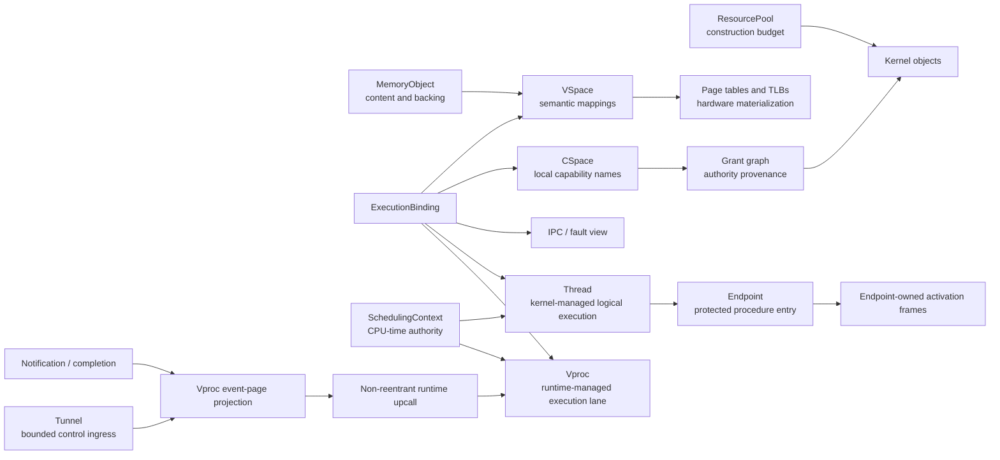

# ChaOs

> A capability-oriented, runtime-native RISC-V microkernel written in freestanding modern C++.

**ChaOs is experimental systems software under active development.** It currently targets RV64 on QEMU's `virt` machine, has no stable ABI, and is not intended for production use.

ChaOs asks a specific question:

> What would an operating system look like if authority, memory, CPU time, execution, and event delivery were independent resources instead of being hidden inside a single process/thread model?

Rather than making a Unix-style `Process` the implicit owner of an address space, capability table, threads, scheduling policy, IPC state, and resources, ChaOs exposes these concerns as separate kernel objects with explicit ownership and capability-controlled relationships. User space can compose them into process-like services, user-mode runtimes, protected procedure domains, or other execution models.

The project is also an experiment in using freestanding C++23 to express low-level ownership, state machines, and hardware-visible invariants without exceptions, RTTI, or a hosted runtime.

---

## Design goals

ChaOs is built around several goals:

- make authority derivation, attenuation, revocation, and persistent relationships explicit;
- separate logical execution, address-space bindings, and CPU-time authority;
- support user-mode runtimes without representing every user task as a kernel thread;
- distinguish canonical kernel state from user-visible projections and hardware materialization;
- carry resource accounting through object construction, lifetime, revocation, and retirement;
- preserve auditable machine-level behavior while still using strong C++ abstractions;
- treat SMP, failure paths, and diagnostics as architectural concerns rather than later additions.

The source should make it possible to answer four questions for every important mechanism:

1. Who owns the state?
2. Which execution path may change it?
3. What invariant makes the operation safe?
4. When is the operation actually complete?

---

## Architecture at a glance



The diagram is deliberately not a process tree. Address space, authority, execution, CPU time, memory, and communication are independent roots that can be connected only through explicit contracts.

---

## Distinctive mechanisms

### Capability authority is not just a handle check

A capability handle is only a local name. ChaOs separately represents:

- object identity and lifetime;
- authority provenance in a derivation graph;
- a grant ceiling that cannot be amplified by descendants;
- a local slot view that can further attenuate authority;
- generation-protected capability handles;
- persistent relationships created by authorized operations;
- revocation work that may continue after a slot disappears.

This separation allows `copy`, `move`, `delegate`, `close`, `revoke`, and `destroy` to retain different meanings instead of collapsing them into reference-count manipulation.

Revocation is not considered complete merely because a CSpace slot was removed. When authority has produced hardware-visible state, completion must flow through semantic invalidation, page-table changes, remote TLB shootdown, attachment quiescence, and deferred retirement.

### Resource creation is explicit and sponsor-backed

Kernel objects are not created from an invisible global heap.

A `ResourcePool` carries bounded construction authority. Reservations are made before publication, committed only when object construction succeeds, and refunded only after the relevant lifetime and cleanup obligations have ended. Child pools and sponsorship relationships allow resource authority to be delegated without pretending that accounting and object lifetime are the same mechanism.

This is intended to support resource-honest services: an object may disappear from a namespace before its memory, remote references, hardware effects, or sponsored descendants are safe to reclaim.

### Execution, bindings, and CPU time are separate

ChaOs does not make one thread object own everything required to execute.

- `ExecutionBinding` describes the address space, capability space, IPC view, and related execution environment.
- `SchedulingContext` represents kernel-enforced CPU-time authority, budget, refill state, and urgency.
- `Thread` is a stable, kernel-managed logical execution identity.
- `Vproc` is a kernel-visible execution lane whose user continuations are owned by a user-mode runtime.
- `CpuDispatcher` commits validated execution and scheduling state on a CPU.

This separation leaves room for multiple execution models without creating a second scheduler hidden in a fast path.

### Vproc: a lane for user-mode runtimes

A Vproc is not a kernel object for each fiber or coroutine. It is a schedulable execution lane granted to a user runtime.

The kernel owns:

- the lane and its scheduling state;
- a bounded asynchronous-operation table;
- pinned control and event-page mappings;
- ingress relationships;
- one non-reentrant runtime-upcall frame;
- activation, parking, stopping, and lifetime boundaries.

The runtime owns:

- user continuations;
- fiber or coroutine scheduling;
- the policy for handling projected events;
- the continuation to resume after an upcall.

The current contract prefers asynchronous completion. An event first changes canonical kernel state and is projected into the Vproc event page. Activation is only a retained request to establish a safe runtime boundary; it is not the event truth itself.

A sequence-based park protocol prevents the ordinary lost-wakeup race:

```text
observe pending sequence
        |
        v
attempt to park only if no newer event exists
        |
        +---- newer event already published ---> reject the park
        |
        +---- still quiescent -----------------> commit Parked
```

When the lane returns through a safe trap boundary, the kernel may redirect it into one non-reentrant upcall. The runtime inspects the event page, handles work in batches, and returns an explicit continuation.

### Canonical events and projected event pages

Notification, operation-completion, and ingress state remain canonical in their owning kernel objects. A Vproc event page is a read-only projection for user space, not a second authority source.

The event page can expose:

- completed operation slots;
- notification levels and sequences;
- Tunnel ingress sequences and receiver-defined tags;
- the interrupted user continuation;
- the active upcall generation;
- a monotonically changing pending sequence.

This design avoids requiring a syscall and scheduler transition for every individual event while preserving a kernel-owned truth source.

### Tunnel: a bounded control path, not a message queue

A Tunnel has no payload queue.

The receiver opens a Tunnel for its current Vproc and delegates limited `Connect` authority to a source. The source obtains a transmit relationship and invokes a monotonically sequenced ingress. The receiver observes the sequence through its Vproc event page and acknowledges it explicitly.

The intended distinction is:

- `Notification` says that work is pending;
- an `Endpoint` performs a protected service call;
- a `Tunnel` asks a runtime to change or reconsider current execution.

Potential uses include runtime preemption, cancellation, deadline changes, safepoints, supervision, profiling, and other bounded user-space interrupt semantics. The mechanism is still experimental; denial-of-service control, fairness, nesting, and long-term ABI rules remain active design work.

### Endpoint: protected procedure execution

An `Endpoint` is an immutable protected-procedure entry backed by a fixed, sponsor-paid activation pool.

A call can:

- validate an authority-specific badge and transfer limits;
- snapshot and transfer capabilities;
- enforce call depth, urgency ceilings, and minimum remaining budget;
- queue when no activation is free;
- redirect the caller's logical execution into a callee-owned binding and stack;
- return through the saved caller continuation;
- unwind or cancel when authority is revoked or execution stops.

Endpoint activations are not independent kernel threads. They are endpoint-owned execution frames used by the caller's logical thread. This is the current foundation for exploring caller-attributed protected calls without reducing them to asynchronous server queues.

### Semantic virtual memory

Virtual memory is split by responsibility:

- `MemoryObject` owns logical content and backing;
- `VSpace` owns semantic address layout and mappings;
- mapping relationships retain the authority and lifetime needed for invalidation;
- page tables and TLB entries materialize VSpace state;
- remote shootdown and deferred retirement close the SMP lifetime.

The long-term direction is to allow user-space pagers and services to supply content without transferring ownership of virtual-address semantics or hardware consistency out of the kernel.

### One truth owner per mechanism

ChaOs tries to avoid duplicate state machines.

Examples:

- operation slots own operation completion truth; activation only requests delivery;
- Notification owns pending level and sequence; an event page only projects them;
- VSpace owns semantic mappings; page tables and TLBs only materialize them;
- the grant graph owns authority provenance; a CSpace slot is only a local reference;
- the dispatcher owns committed CPU execution state;
- ResourcePool accounting does not substitute for object lifetime.

Caches, projections, reverse indexes, remote requests, and hardware registers are useful only when their relation to the canonical owner is explicit.

---

## Modern C++ in a freestanding kernel

ChaOs uses C++23 as a systems-construction language rather than as a hosted application runtime.

The kernel is built with:

- no exceptions;
- no RTTI;
- no thread-safe static initialization runtime;
- no hosted standard library;
- no general-purpose kernel heap requirement;
- audited compiler-runtime and vtable dependencies.

The code uses:

- strong types for addresses, object IDs, capabilities, CPU IDs, ranges, and time;
- RAII and move-only ownership for pages, roots, grants, charges, views, and leases;
- `Expected`-style error propagation;
- concepts, traits, templates, and static polymorphism;
- fixed-capacity and intrusive containers;
- explicit state machines and generation counters;
- `[[nodiscard]]`, `noexcept`, and compile-time ABI/layout checks;
- a purpose-built `libk` with formatting, atomics, delegates, intrusive structures, and allocation-aware containers.

Advanced language features are used when they make ownership or invariants clearer. They are not used to hide scheduling, memory ordering, ABI, or hardware behavior.

---

## Current implementation status

| Area | Status |
|---|---|
| RV64 boot and QEMU `virt` platform | Implemented |
| FDT parsing, boot handoff, timebase, and SMP startup | Implemented |
| Physical memory, kernel stacks, Sv39, direct map, and kernel VSpace | Implemented |
| `MemoryObject`, semantic `VSpace`, mapping/protection/unmap, and TLB invalidation | Implemented |
| Object store, typed object pools, CSpace, grant derivation, attenuation, and revoke | Implemented and evolving |
| Resource pools, reservations, sponsorship, construction charging, and refund | Implemented |
| Scheduling domains, SchedulingContext budget/refill, timers, remote queues, and dispatcher | Implemented and evolving |
| Kernel-managed threads and user trap/syscall return | Implemented |
| Notifications, asynchronous operation completion, and wait integration | Implemented |
| Vproc control/event ABI, operation table, park/activation, and runtime upcall | Implemented; end-to-end return path is under active stabilization |
| Tunnel connect/invoke/ack and Vproc ingress projection | Implemented; proof coverage is being stabilized |
| Endpoint protected calls, activation pools, call queueing, capability transfer, reply, and unwind | Experimental implementation |
| External `init`, boot bundles, independent user ELFs, and bootstrap capabilities | Implemented |
| Panic snapshots, guarded stacks, bounded backtraces, and degraded-SMP panic probes | Implemented |
| Filesystem, network stack, production drivers, pager service, and stable public ABI | Not yet implemented |

The current milestone is closing the final Vproc activation-to-upcall trap-return continuation under SMP, strengthening remote-request lifetime rules, and turning the proof workload into smaller focused integration tests.

---

## Build profiles

ChaOs has three explicit build profiles:

| Profile | Purpose |
|---|---|
| `kernel` | Base kernel image |
| `test` | Kernel image with built-in test suites |
| `proof` | Built-in tests plus independent user-space `init` and proof payloads |

Build products are isolated under:

```text
build/<arch>/<profile>/
```

The only supported architecture is currently:

```text
ARCH=riscv64
```

---

## Prerequisites

You need:

- GNU Make;
- `qemu-system-riscv64`;
- either `riscv-none-elf-*` or `riscv64-unknown-elf-*` GCC/binutils;
- Clang for the optional independent syntax audit;
- GDB or `gdb-multiarch` for interactive debugging.

The Makefile searches for the xPack `riscv-none-elf` toolchain first, then compatible toolchains in `PATH`. A prefix can be selected explicitly:

```sh
make CROSS=riscv64-unknown-elf-
```

---

## Build and run

Build the base kernel:

```sh
make
```

Run it under QEMU:

```sh
make run
```

Build the test profile and run its SMP checks:

```sh
make test
make run-test-smp
```

Build the external user-space proof bundle and run it:

```sh
make proof
make run-proof-smp
```

Exercise the external `init` loader and task-reclamation path:

```sh
make run-e1-smp
```

Change the number of QEMU harts:

```sh
make run-test-smp QEMU_SMP=8
```

Start a GDB-compatible QEMU session:

```sh
make debug
```

Generate disassembly or inspect symbols:

```sh
make disasm
make symbols
```

---

## Audits and failure probes

The build includes several checks intended to keep freestanding assumptions visible.

```sh
make audit-symbols
make audit-clang
```

The audits check for:

- non-lock-free atomic runtime fallbacks;
- unexpected exception/unwind dependencies;
- RTTI symbols;
- virtual dispatch outside the narrow object-store whitelist;
- oversized or dynamic C++ stack frames;
- invalid user-ELF dependencies;
- accidental floating-point or vector-state requirements in user payloads.

Panic paths can be exercised under normal and degraded SMP conditions:

```sh
make run-panic-smp
make run-panic-degraded-smp
```

These probes are part of the architecture: a panic path must not assume that every remote hart, lock owner, stack, or diagnostic component remains healthy.

---

## Repository layout

```text
arch/       RISC-V boot, traps, contexts, SBI, timers, CPU, and Sv39 mechanisms
kernel/     capabilities, objects, resources, execution, scheduling, VM, IPC, and syscalls
libk/       audited freestanding C/C++ foundations and fixed-capacity data structures
platform/   board-specific integration; currently minimal for QEMU `virt`
uapi/       C, C++, and assembly-safe user/kernel ABI declarations
user/       freestanding user runtime, syscall wrappers, and context helpers
servers/    external `init` and end-to-end proof payloads
tools/      host-side boot-bundle tooling
test/       built-in unit and architectural tests
```

The public architecture contract is selected directly from:

```text
arch/<arch>/include/arch/
```

Architecture-independent kernel code includes `<arch/...>` contracts without an additional wrapper/alias stack.

---

## Research directions

ChaOs is not committed to reproducing one existing microkernel. It draws lessons from capability systems, L4-family kernels, scheduling-context designs, user-mode scheduling, scheduler activations, and runtime-oriented systems, then tests a different combination.

The most important longer-term questions are:

### Runtime-native execution

Can a user-mode runtime schedule large numbers of fibers or coroutines over a capability-controlled set of Vprocs while the kernel still enforces CPU time, isolation, stopping, and fault boundaries?

### Budget-carrying protected calls

Can a protected call carry caller-attributed time, bounded authority, memory projections, cancellation, and completion without requiring a permanently scheduled server thread?

### Capability-scoped execution leases

Can execution capacity itself be delegated, attenuated, reclaimed, and composed with a task's resource and authority envelope?

### Bounded user-space interrupt fabric

Can Tunnel-like ingress provide useful preemption, cancellation, safepoints, and supervision without inheriting the uncontrolled reentrancy and global semantics of traditional Unix signals?

### Dynamic service and agent sandboxes

Can a service, plugin, or local AI agent receive only the capabilities, memory views, CPU budget, execution lanes, and cancellation paths needed for one task, then have the entire delegation safely revoked?

These are research directions, not completed claims.

---

## Roadmap

Near-term work:

1. close and instrument the Vproc activation/upcall/return path on SMP;
2. remove duplicate remote-request lifetime truth and strengthen concurrency audits;
3. split the current proof payload into focused Notification, Vproc, Tunnel, and Endpoint integration tests;
4. stabilize the first user-runtime ABI and build a small fiber/coroutine scheduler;
5. complete protected-call budget attribution, cancellation, and nested-call contracts;
6. add fault IPC and a user-space pager path;
7. move additional policy, drivers, and system services into user space.

Longer-term work may include IRQ/device objects, user-space drivers, storage and networking services, additional architectures, and higher-level runtime experiments.

---

## Non-goals

ChaOs is currently not trying to:

- provide Unix or POSIX compatibility;
- become a production operating system in the near term;
- hide all hardware details behind a large framework;
- represent every concept through inheritance or virtual dispatch;
- add abstractions solely because C++ can express them;
- claim novelty for mechanisms that already have prior art;
- accept test-passing patches that leave ownership or lifetime contracts incoherent.

Breaking refactors are expected when they remove duplicate truth, clarify ownership, or produce a cleaner long-term contract.

---

## AI-assisted engineering

AI is used as a design partner, implementation assistant, adversarial reviewer, and debugging aid.

The human maintainer defines direction, challenges assumptions, reviews architectural changes, inspects generated code, and decides whether evidence is sufficient. AI-generated conclusions are not accepted merely because the code compiles or a local test passes.

Changes are expected to survive some combination of:

- direct source review;
- architectural-invariant review;
- compiler and linker audits;
- built-in tests;
- QEMU SMP execution;
- disassembly inspection;
- crash-trace analysis;
- GDB evidence.

ChaOs is therefore also an experiment in disciplined, human-in-the-loop AI-assisted systems engineering on a codebase where local correctness is not enough.

---

## Project status and participation

ChaOs is a learning and research kernel maintained primarily by one developer. Interfaces and internal structure can change without compatibility guarantees.

Issue reports, design criticism, prior-art references, concurrency reviews, and focused tests are welcome. For large implementation changes, open a design issue before investing in a patch so that ownership and mechanism boundaries can be discussed first.

The repository name is `ChaOs`; some internal UAPI identifiers still use the historical `MYOS_*` prefix during the experimental phase.

---

## License

BSD 3-Clause License

Copyright (c) 2026, lynn-Tam

Redistribution and use in source and binary forms, with or without
modification, are permitted provided that the following conditions are met:

1. Redistributions of source code must retain the above copyright notice, this
   list of conditions and the following disclaimer.

2. Redistributions in binary form must reproduce the above copyright notice,
   this list of conditions and the following disclaimer in the documentation
   and/or other materials provided with the distribution.

3. Neither the name of the copyright holder nor the names of its
   contributors may be used to endorse or promote products derived from
   this software without specific prior written permission.

THIS SOFTWARE IS PROVIDED BY THE COPYRIGHT HOLDERS AND CONTRIBUTORS "AS IS"
AND ANY EXPRESS OR IMPLIED WARRANTIES, INCLUDING, BUT NOT LIMITED TO, THE
IMPLIED WARRANTIES OF MERCHANTABILITY AND FITNESS FOR A PARTICULAR PURPOSE ARE
DISCLAIMED. IN NO EVENT SHALL THE COPYRIGHT HOLDER OR CONTRIBUTORS BE LIABLE
FOR ANY DIRECT, INDIRECT, INCIDENTAL, SPECIAL, EXEMPLARY, OR CONSEQUENTIAL
DAMAGES (INCLUDING, BUT NOT LIMITED TO, PROCUREMENT OF SUBSTITUTE GOODS OR
SERVICES; LOSS OF USE, DATA, OR PROFITS; OR BUSINESS INTERRUPTION) HOWEVER
CAUSED AND ON ANY THEORY OF LIABILITY, WHETHER IN CONTRACT, STRICT LIABILITY,
OR TORT (INCLUDING NEGLIGENCE OR OTHERWISE) ARISING IN ANY WAY OUT OF THE USE
OF THIS SOFTWARE, EVEN IF ADVISED OF THE POSSIBILITY OF SUCH DAMAGE.